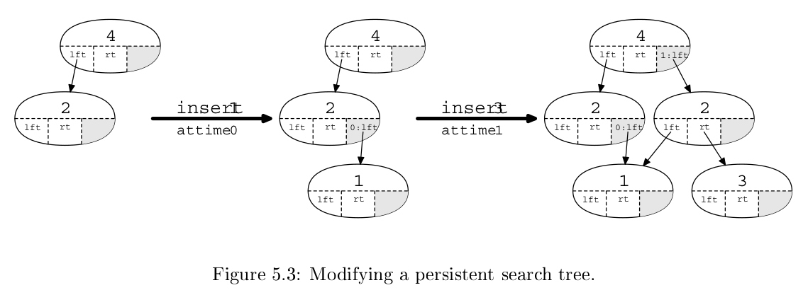

# persistent-data-structure

Курсовой проект "Неизменяемые структуры данных (Persistent Data
Structures)".

## Задача

Реализация библиотеки содержащей следующие структуры данных:
- Массив
- Двусвязный список
- Ассоциативный массив

поддерживающие операции возврата к предыдущему состоянию.

### Требования к структурам данных
- Все структуры поддерживают единый API.
- Произвольная вложенность данных.
- Универсальный undo-redo механизм.
- Более эффективное по скорости доступа представление структур данных, чем fat-node.

## Реализация

### Единый API
В качестве единого API создан интерфейс
```java
/**
 * Структура данных поддерживающая операции возврата к предыдущему состоянию.
 */
public interface PersistentStructure {

    /**
     * Выполняет возврат к предыдущей версии.
     */
    void undo();


    /**
     * Отменяет возврат к предыдущей версии.
     */
    void redo();

}
```
Все реализованные структуры данных реализуют данный интерфейс.

### Алгоритм
За основу взяты статьи:
- [Advanced Algorithms Persistent Data Structures](https://ocw.mit.edu/courses/6-854j-advanced-algorithms-fall-2005/resources/lec05_1999/)
- [J.R. Driscoll, Neil Sarnak, D.D. Sleator, R.E Tarjan Making Data Structures Persistent](https://www.cs.cmu.edu/~sleator/papers/another-persistence.pdf)

Алгоритм основан на узле, содержащем ссылку на левый узел, правый узел, значение в узле, а так же информацию о модификации левого узла, правого узла, или значения, а так же версию начиная с которой это изменение было применено.

Для реализации структур данных на основе такого подхода, была реализована вспомогательная структура [ModificationBoxNode<T, V extends Comparable<V>>](persistent-data-structure-lib/src/main/java/ru/nsu/ccfit/persistent/data/structure/node/ModificationBoxNode.java)
```java
/**
 * Обновляемый узел.
 *
 * @param <T> Тип значения в узле.
 * @param <V> Тип значения версии.
 */
public class ModificationBoxNode<T, V extends Comparable<V>> {

    /**
     * Возвращает значение левого узла в запрашиваемой версии.
     *
     * @param version Версия.
     * @return Значение левого узла в запрашиваемой версии.
     */
    public ModificationBoxNode<T, V> getLeft(V version) { ... }

    /**
     * Возвращает значение правого узла в запрашиваемой версии.
     *
     * @param version Версия.
     * @return Значение правого узла в запрашиваемой версии.
     */
    public ModificationBoxNode<T, V> getRight(V version) { ... }

    /**
     * Возвращает значение в запрашиваемой версии.
     *
     * @param version Версия.
     * @return Значение в запрашиваемой версии.
     */
    public T getValue(V version) { ... }

    /**
     * Возвращает текущую модификацию узла.
     *
     * @return Текущую модификацию узла.
     */
    public ModificationBox<T, V> getModificationBox() { ... }

    /**
     * Возвращает обновленный узел.
     *
     * @param modification Обновление.
     * @return Обновленный узел.
     */
    public ModificationBoxNode<T, V> modify(ModificationBox<T, V> modification) { ... }

    /**
     * Удаляет из узла информацию о всех модификациях совершенных в версиях выше указанной.
     *
     * @param version Версия.
     */
    public void cleanFromVersion(V version) { ... }

}
```

На основе такой структуры данных реализованы структуры:
- Двусвязный список
- Ассоциативный массив

### Массив
[PersistentArray\<E>](persistent-data-structure-lib/src/main/java/ru/nsu/ccfit/persistent/data/structure/array/PersistentArray.java) реализует естественный для Java интерфейс List<E>
и основывается на структуре [ArrayHead\<E>](persistent-data-structure-lib/src/main/java/ru/nsu/ccfit/persistent/data/structure/array/utils/ArrayHead.java)

### Двусвязный список
[PersistentDoubleLinkedList\<V>](persistent-data-structure-lib/src/main/java/ru/nsu/ccfit/persistent/data/structure/list/PersistentDoubleLinkedList.java) реализует естественный для Java интерфейс List<V>
и основывается на структуре [ModificationBoxNode<V, Long>](persistent-data-structure-lib/src/main/java/ru/nsu/ccfit/persistent/data/structure/node/ModificationBoxNode.java)

### Ассоциативный массив
[PersistentMap<K, V>](persistent-data-structure-lib/src/main/java/ru/nsu/ccfit/persistent/data/structure/map/PersistentMap.java) реализует естественный для Java интерфейс Map<K, V>
и основывается на структуре [ModificationBoxNode<Map.Entry<K, V>, Long>](persistent-data-structure-lib/src/main/java/ru/nsu/ccfit/persistent/data/structure/node/ModificationBoxNode.java)
